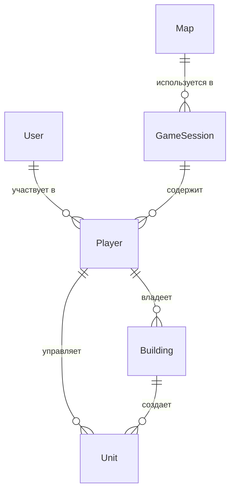

# Модели данных (Сущности)

Этот документ описывает основные сущности данных, используемые в приложении. Они служат основой для схемы базы данных (Prisma) и для управления состоянием на клиенте (Zustand).

---

### Сущность: `User` (Пользователь)

**Описание:** Представляет учетную запись пользователя в системе. Не связана напрямую с игровой логикой, используется для аутентификации и авторизации.

**Атрибуты:**

| Поле | Тип данных | Описание | Ограничения/Примечания | Обязательное |
|---|---|---|---|---|
| `id` | UUID | Уникальный идентификатор пользователя | Генерируется системой (PK) | Да |
| `email` | String | Адрес электронной почты | Уникальный, валидный email | Да |
| `password_hash`| String | Хеш пароля | | Да |
| `created_at` | DateTime | Дата и время создания | | Да |
| `updated_at` | DateTime | Дата и время обновления | | Да |

**Связи:**

- **1:N** с `Player` - один пользователь может участвовать в нескольких игровых сессиях

---

### Сущность: `GameSession` (Игровая сессия)

**Описание:** Представляет одну игровую партию. Содержит общее состояние игры, в которой участвует несколько игроков.

**Атрибуты:**

| Поле | Тип данных | Описание | Ограничения/Примечания | Обязательное |
|---|---|---|---|---|
| `id` | UUID | Уникальный идентификатор сессии | Генерируется системой (PK) | Да |
| `map_id` | UUID | Идентификатор карты (FK) | Ссылка на `Map.id` | Нет |
| `status` | Enum | Текущий статус игры | `WAITING`, `GENERATING_MAP`, `IN_PROGRESS`, `FINISHED` | Да |
| `created_at` | DateTime | Дата и время создания | | Да |
| `finished_at`| DateTime | Дата и время завершения | | Нет |

**Связи:**

- **1:N** с `Player` - в одной сессии участвует несколько игроков
- **1:1** с `Map` - одна сессия использует одну карту

---

### Сущность: `Player` (Игрок)

**Описание:** Представляет игрока внутри конкретной `GameSession`. Связывает `User` с его игровым состоянием.

**Атрибуты:**

| Поле | Тип данных | Описание | Ограничения/Примечания | Обязательное |
|---|---|---|---|---|
| `id` | UUID | Уникальный идентификатор игрока | Генерируется системой (PK) | Да |
| `user_id` | UUID | Идентификатор пользователя (FK) | Ссылка на `User.id` | Да |
| `game_session_id`| UUID | Идентификатор игровой сессии (FK)| Ссылка на `GameSession.id` | Да |
| `resources` | JSON | Объект с количеством ресурсов | `{"gold": 100, "crystals": 0}` | Да |
| `is_winner` | Boolean | Флаг, был ли игрок победителем | | Нет |

**Связи:**

- **N:1** с `User` - игрок принадлежит одному пользователю
- **N:1** с `GameSession` - игрок участвует в одной сессии
- **1:N** с `Building` - у игрока может быть несколько зданий
- **1:N** с `Unit` - у игрока может быть несколько юнитов

---

### Сущность: `Building` (Здание)

**Описание:** Представляет здание, построенное игроком на карте.

**Атрибуты:**

| Поле | Тип данных | Описание | Ограничения/Примечания | Обязательное |
|---|---|---|---|---|
| `id` | UUID | Уникальный идентификатор здания | Генерируется системой (PK) | Да |
| `player_id` | UUID | Идентификатор игрока-владельца (FK) | Ссылка на `Player.id` | Да |
| `type` | Enum | Тип здания | `SPAWN`, `BARRACKS`, `MINE`, `SCOUT_POST` | Да |
| `position` | JSON | Координаты на карте | `{"x": 10, "y": 25}` | Да |
| `path` | JSON | Массив координат пути для юнитов | `[{"x": 10, "y": 26}, ...]` | Нет |

**Связи:**

- **N:1** с `Player` - здание принадлежит одному игроку
- **1:N** с `Unit` - здание может создавать несколько юнитов

---

### Сущность: `Unit` (Юнит)

**Описание:** Представляет юнита, созданного зданием.

**Атрибуты:**

| Поле | Тип данных | Описание | Ограничения/Примечания | Обязательное |
|---|---|---|---|---|
| `id` | UUID | Уникальный идентификатор юнита | Генерируется системой (PK) | Да |
| `player_id` | UUID | Идентификатор игрока-владельца (FK) | Ссылка на `Player.id` | Да |
| `building_id`| UUID | ID здания, которое его создало (FK) | Ссылка на `Building.id` | Да |
| `type` | Enum | Тип юнита | `DIGGER`, `MINER`, `WARRIOR`, `SCOUT` | Да |
| `position` | JSON | Текущие координаты на карте | `{"x": 11, "y": 28}` | Да |
| `health` | Integer | Текущее здоровье юнита | | Да |

**Связи:**

- **N:1** с `Player` - юнит принадлежит одному игроку
- **N:1** с `Building` - юнит создан одним зданием

---

### Сущность: `Map` (Карта)

**Описание:** Представляет игровую карту с ее структурой.

**Атрибуты:**

| Поле | Тип данных | Описание | Ограничения/Примечания | Обязательное |
|---|---|---|---|---|
| `id` | UUID | Уникальный идентификатор карты | Генерируется системой (PK) | Да |
| `size` | JSON | Размеры карты | `{"width": 100, "height": 100}`| Да |
| `terrain_data`| JSON | Данные о ландшафте (расположение пород, ресурсов) | | Да |
| `spawn_points`| JSON | Координаты стартовых позиций для игроков| `[{"x": 10, "y": 10}, ...]` | Да |
| `game_session`| String | Уникальная ссылка на игровую сессию | Уникальное поле, ссылка на GameSession | Да |

**Связи:**

- **1:N** с `GameSession` - карта может использоваться в нескольких сессиях

**Пример объекта:**

```json
{
  "id": "a1b2c3d4-e5f6-7890-1234-567890abcdef",
  "size": { "width": 100, "height": 100 },
  "terrain_data": [
    [ "Dirt", "Rock", "Bedrock", ... ],
    ...
  ],
  "spawn_points": [
    { "x": 10, "y": 10 },
    { "x": 90, "y": 90 }
  ],
  "game_session": "session-uuid-here"
}
```

---

## Схема связей между сущностями


