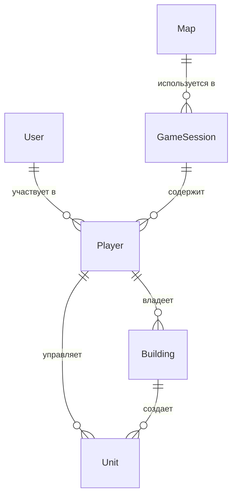

# Модели данных (Сущности)

Этот документ описывает основные сущности данных, используемые в приложении. Они служат основой для схемы базы данных (Prisma) и для управления состоянием на клиенте (Zustand).

---

### 2.1. User (Пользователь)

**Описание:** Учетная запись пользователя для входа в систему.

| Поле | Тип данных | Описание | Ограничения/Примечания | Обязательное |
|------|------------|----------|------------------------|--------------|
| `id` | UUID | Уникальный идентификатор пользователя | Генерируется системой | Да (PK) |
| `email` | String | Email пользователя | Уникальный, валидный формат | Да |
| `password_hash` | String | Хеш пароля | bcrypt хеш | Да |
| `created_at` | Timestamp | Дата и время создания записи | | Да |
| `updated_at` | Timestamp | Дата и время последнего обновления | | Да |

**Пример объекта:**

```json
{
  "id": "a1b2c3d4-e5f6-7890-1234-567890abcdef",
  "email": "user@example.com",
  "passwordHash": "$2b$10$...",
  "createdAt": "2023-10-27T10:00:00Z",
  "updatedAt": "2023-10-27T10:00:00Z"
}
```

### 2.2. GameSession (Игровая сессия)

**Описание:** Представляет игровую сессию с картой и игроками.

| Поле | Тип данных | Описание | Ограничения/Примечания | Обязательное |
|------|------------|----------|------------------------|--------------|
| `id` | UUID | Уникальный идентификатор сессии | Генерируется системой | Да (PK) |
| `status` | Enum | Статус игровой сессии | GameSessionStatus | Да |
| `created_at` | Timestamp | Дата и время создания записи | | Да |
| `finished_at` | Timestamp | Дата и время завершения | Может быть null | Нет |

**GameSessionStatus enum:**

- `GENERATING_MAP` - Карта генерируется
- `WAITING` - Ожидание игроков
- `IN_PROGRESS` - Игра в процессе
- `FINISHED` - Игра завершена

**Пример объекта:**

```json
{
  "id": "b2c3d4e5-f6a7-8901-2345-67890abcdef1",
  "status": "WAITING",
  "createdAt": "2023-10-27T10:00:00Z",
  "finishedAt": null
}
```

### 2.3. Player (Игрок)

**Описание:** Представляет игрока в конкретной игровой сессии.

| Поле | Тип данных | Описание | Ограничения/Примечания | Обязательное |
|------|------------|----------|------------------------|--------------|
| `id` | UUID | Уникальный идентификатор игрока | Генерируется системой | Да (PK) |
| `user_id` | UUID | Идентификатор пользователя | Ссылка на User.id | Да (FK) |
| `game_session_id` | UUID | Идентификатор игровой сессии | Ссылка на GameSession.id | Да (FK) |
| `resources` | JSON | Ресурсы игрока | `{"gold": 100, "crystals": 0}` | Да |
| `is_winner` | Boolean | Флаг победителя | По умолчанию false | Да |

**Пример объекта:**

```json
{
  "id": "c3d4e5f6-a7b8-9012-3456-7890abcdef12",
  "userId": "a1b2c3d4-e5f6-7890-1234-567890abcdef",
  "gameSessionId": "b2c3d4e5-f6a7-8901-2345-67890abcdef1",
  "resources": {
    "gold": 1000,
    "crystals": 50
  },
  "isWinner": false
}
```

### 2.4. Map (Карта)

**Описание:** Представляет игровую карту с местностью и точками спавна.

| Поле | Тип данных | Описание | Ограничения/Примечания | Обязательное |
|------|------------|----------|------------------------|--------------|
| `id` | UUID | Уникальный идентификатор карты | Генерируется системой | Да (PK) |
| `size` | JSON | Размеры карты | `{"x": 100, "y": 100}` | Да |
| `terrain_data` | JSON | 2D массив типов местности | `[["Dirt", "Rock"], ["Bedrock", "Dirt"]]` | Да |
| `spawn_points` | JSON | Точки спавна игроков | `[{"x": 1, "y": 1}, {"x": 98, "y": 98}]` | Да |

**TerrainType enum:**

- `Dirt` - Земля
- `Rock` - Камень
- `Bedrock` - Скальная порода

**Пример объекта:**

```json
{
  "id": "d4e5f6a7-b8c9-0123-4567-890abcdef123",
  "size": {
    "width": 100,
    "height": 100
  },
  "terrainData": [
    ["Dirt", "Rock", "Dirt"],
    ["Bedrock", "Dirt", "Rock"],
    ["Dirt", "Dirt", "Bedrock"]
  ],
  "spawnPoints": [
    {"x": 1, "y": 1},
    {"x": 98, "y": 98}
  ]
}
```

---

## Схема связей между сущностями


