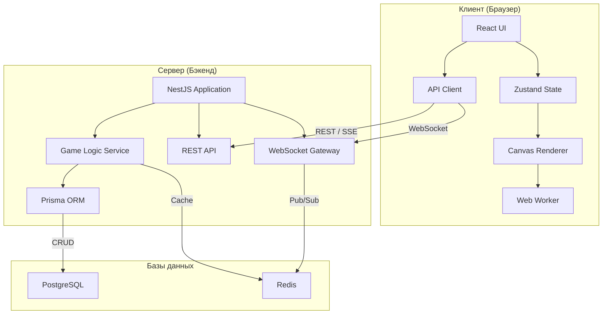
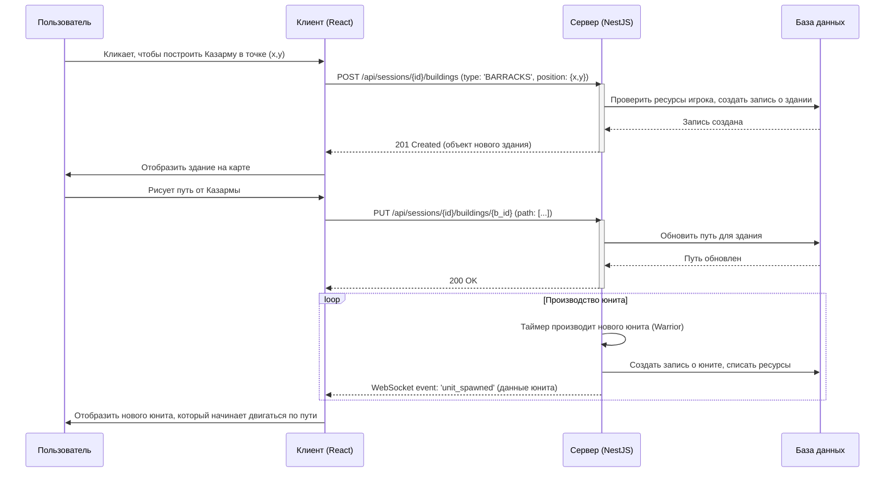

# Архитектура Системы

## 1. Обзор

Система представляет собой многопользовательскую стратегическую игру с распределенной архитектурой, состоящую из клиентского приложения (React), серверного API (NestJS), базы данных (PostgreSQL) и механизмов генерации контента.

-   **Сервер (Backend):** Реализован на NestJS. Отвечает за всю игровую логику, обработку действий игроков, хранение состояния игры и персистентность данных. Является "источником правды" для состояния игры.
-   **Клиент (Frontend):** Реализован на React. Отвечает за визуализацию игрового мира (через Canvas), обработку пользовательского ввода и взаимодействие с сервером для получения обновлений и отправки команд.



## 2. Архитектура Backend

### 2.1. Структура модулей

```
src/
├── core/                    # Основные компоненты
│   ├── db/                 # База данных и миграции
│   ├── env.validation.ts   # Валидация переменных окружения
│   └── filters/            # Глобальные фильтры исключений
├── user/                   # Модуль пользователей
│   ├── api/               # Контроллеры и DTO
│   ├── domain/            # Бизнес-логика
│   ├── db/                # Репозиторий
│   └── lib/               # Мапперы
├── game-session/          # Модуль игровых сессий
│   ├── api/               # Контроллеры, DTO и WebSocket Gateway
│   ├── domain/            # Бизнес-логика
│   ├── db/                # Репозиторий
│   └── lib/               # Мапперы
├── map/                   # Модуль карт
│   ├── api/               # Контроллеры и DTO
│   ├── domain/            # Бизнес-логика
│   ├── db/                # Репозиторий
│   └── lib/               # Мапперы и генерация карт
├── player/                # Модуль игроков
│   ├── api/               # Контроллеры и DTO
│   ├── domain/            # Бизнес-логика
│   ├── db/                # Репозиторий
│   └── lib/               # Мапперы
├── building/              # Модуль зданий
│   ├── api/               # Контроллеры и DTO
│   ├── domain/            # Бизнес-логика
│   ├── db/                # Репозиторий
│   └── lib/               # Мапперы
└── unit/                  # Модуль юнитов
    ├── api/               # Контроллеры и DTO
    ├── domain/            # Бизнес-логика
    ├── db/                # Репозиторий
    └── lib/               # Мапперы
```

### 2.2. Технологический стек

- **Framework**: NestJS
- **Database**: PostgreSQL с Prisma ORM
- **Authentication**: JWT с HttpOnly cookies
- **WebSocket**: Socket.io для real-time обновлений
- **Validation**: class-validator и class-transformer
- **Documentation**: Swagger/OpenAPI
- **Testing**: Jest
- **Logging**: Pino

### 2.3. Паттерны архитектуры

#### Domain-Driven Design (DDD)
- **Entities**: User, GameSession, Player, Map, Building, Unit
- **Value Objects**: Uuid, PasswordHash
- **Services**: Бизнес-логика в domain слое
- **Repositories**: Доступ к данным через интерфейсы

#### Clean Architecture
- **API Layer**: Контроллеры и DTO
- **Domain Layer**: Бизнес-логика и сущности
- **Infrastructure Layer**: Репозитории и внешние сервисы

#### Event-Driven Architecture
- **App Events**: Система событий для асинхронной обработки
- **WebSocket Events**: Real-time обновления для клиентов

## 3. Схема взаимодействия (Пример)

Рассмотрим последовательность действий при постройке здания и создании первого юнита.



## 4. Ключевые компоненты

### 4.1. Backend (NestJS)
- **Модульная архитектура:** Каждая доменная область (пользователи, игровые сессии, карты, здания, юниты, **ресурсы**) реализована как отдельный модуль
- **WebSocket Gateway:** Обеспечивает синхронизацию состояния игры в реальном времени
- **Event-driven архитектура:** Использует EventEmitter2 для связи между модулями

### 4.2. Система генерации карт с ресурсами
- **Map Generation Worker:** Асинхронная генерация карт с ресурсными месторождениями
- **Алгоритм размещения ресурсов:** Использует вероятностное распределение для создания естественных скоплений
- **Балансировка:** Автоматическое масштабирование количества ресурсов в зависимости от размера карты и количества игроков

### 4.3. Ресурсная экономика
- **Типы ресурсов:** Золото (основной), Кристаллы (редкий), Железо (строительный)
- **Истощение месторождений:** Динамическое изменение ландшафта при выработке ресурсов
- **Синхронизация состояния:** Отслеживание количества ресурсов в каждой ячейке карты

### 4.4. Механика раскопки и строительства
- **Типы поверхности:** 7 различных типов включая пустые ячейки (`Empty`)
- **Раскопка:** Преобразование любой поверхности (кроме `Bedrock`) в проходимую `Empty` ячейку
- **Строительство:** Размещение зданий возможно только на `Empty` ячейках
- **Проходимость:** Только `Empty` ячейки доступны для перемещения юнитов
- **Стартовые зоны:** Автоматическое создание свободной зоны радиусом 2 клетки вокруг спавна каждого игрока

### 4.5. Сбалансированная генерация
- **Справедливый старт:** Все игроки получают одинаковые стартовые условия
- **Защищенные зоны:** Ресурсы не размещаются в радиусе 4 клеток от точек спавна
- **Немедленная игра:** Игроки могут сразу начать строительство без предварительной раскопки
