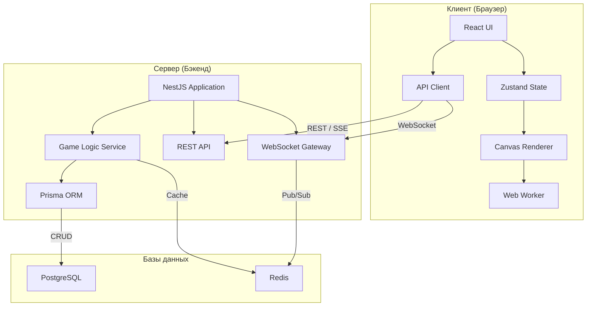
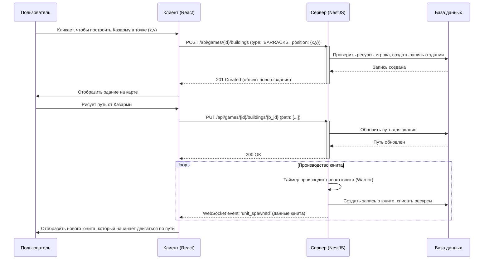

# Архитектура Системы

## 1. Обзор

Система построена на основе классической клиент-серверной архитектуры.

-   **Сервер (Backend):** Реализован на NestJS. Отвечает за всю игровую логику, обработку действий игроков, хранение состояния игры и персистентность данных. Является "источником правды" для состояния игры.
-   **Клиент (Frontend):** Реализован на React. Отвечает за визуализацию игрового мира (через Canvas), обработку пользовательского ввода и взаимодействие с сервером для получения обновлений и отправки команд.

## 2. Технологии взаимодействия

Для обмена данными между клиентом и сервером используются несколько технологий, каждая для своих задач.

### 2.1. REST API

-   **Назначение:** Используется для запросов, не требующих мгновенной реакции и низкой задержки. Это "командные" и "ресурсные" эндпоинты.
-   **Примеры:**
    -   Аутентификация и регистрация пользователя.
    -   Получение списка доступных игровых сессий.
    -   Создание новой игры или присоединение к существующей.
    -   Выполнение атомарных действий в игре (например, размещение нового здания, изменение пути для юнитов).
    -   Получение статических данных (например, характеристики юнитов).

### 2.2. WebSockets

-   **Назначение:** Основной канал для получения обновлений состояния игры в реальном времени. Обеспечивает двунаправленную связь с низкой задержкой.
-   **Примеры:**
    -   Рассылка всем клиентам в игровой сессии информации о движении юнитов.
    -   Уведомление об изменении количества ресурсов игрока.
    -   Сообщение о постройке здания другим игроком.
    -   Обновление разрушенной породы на карте.

### 2.3. Server-Sent Events (SSE)

-   **Назначение:** Может использоваться для однонаправленной передачи данных от сервера к клиенту. Является более легковесной альтернативой WebSockets для случаев, когда клиенту нужно только получать данные.
-   **Возможное применение:**
    -   Глобальные нотификации (например, "Сервер перезапустится через 5 минут").
    -   Стриминг логов игровой сессии для наблюдателей.

### 2.4. Web Workers (Клиент)

-   **Назначение:** Вынесение "тяжелых" вычислений из основного потока JavaScript для предотвращения блокировки и "зависания" UI.
-   **Примеры:**
    -   Расчеты, связанные с рендерингом на Canvas (например, подготовка кадров анимации).
    -   Предварительные расчеты путей юнитов на стороне клиента для отображения.
    -   Обработка больших объемов данных, приходящих от сервера, перед их отображением.

## 3. Схема взаимодействия (Пример)

Рассмотрим последовательность действий при постройке здания и создании первого юнита.

