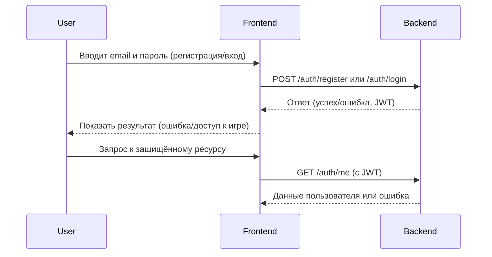

# Регистрация, авторизация и аутентификация пользователя/игрока

## 1. Описание функциональности

**User Story:**
Как новый пользователь, я хочу зарегистрироваться в системе, чтобы получить доступ к игровым возможностям.
Как зарегистрированный пользователь, я хочу войти в систему, чтобы продолжить игру и управлять своими игровыми сессиями.
Как игрок, я хочу быть уверенным, что мои данные защищены, а доступ к игровым функциям возможен только после успешной аутентификации.

**Acceptance Criteria:**
1. Пользователь может зарегистрироваться, указав email и пароль.
2. Система проверяет уникальность email.
3. Пароль хранится в базе данных только в хешированном виде.
4. После успешной регистрации пользователь может войти в систему, указав email и пароль.
5. При успешной авторизации выдается JWT-токен для доступа к защищённым ресурсам.
6. Для доступа к защищённым эндпоинтам требуется валидный JWT-токен.
7. В случае неуспешной авторизации возвращается корректная ошибка.
8. Пользователь может быть связан с сущностью игрока (Player) в рамках игровой сессии.

---

## 2. Описание API

### 2.1. Регистрация пользователя

#### POST /api/v1/auth/register

**Назначение:** Регистрация нового пользователя.

**Request Body (`application/json`):**

| Поле       | Тип    | Описание                  | Обязательное |
|------------|--------|---------------------------|--------------|
| `email`    | String | Email пользователя        | Да           |
| `password` | String | Пароль пользователя       | Да           |

**Пример Request Body:**
```json
{
  "email": "user@example.com",
  "password": "password123"
}
```

**Responses:**

* **`201 Created` — Успешная регистрация**
    ```json
    {
      "id": "uuid-v4",
      "email": "user@example.com",
      "createdAt": "2024-06-01T12:00:00Z"
    }
    ```
* **`400 Bad Request` — Некорректные данные**
    ```json
    {
      "error": "Validation Error",
      "messages": ["Email is required", "Password is required"]
    }
    ```
* **`409 Conflict` — Email уже зарегистрирован**
    ```json
    {
      "error": "Email already exists"
    }
    ```

---

### 2.2. Авторизация пользователя

#### POST /api/v1/auth/login

**Назначение:** Аутентификация пользователя и выдача JWT токена.

**Request Body (`application/json`):**

| Поле       | Тип    | Описание                  | Обязательное |
|------------|--------|---------------------------|--------------|
| `email`    | String | Email пользователя        | Да           |
| `password` | String | Пароль пользователя       | Да           |

**Пример Request Body:**
```json
{
  "email": "user@example.com",
  "password": "password123"
}
```

**Responses:**

* **`200 OK` — Успешная аутентификация**
    ```json
    {
      "accessToken": "jwt.token.here",
      "refreshToken": "refresh.token.here",
      "expiresIn": 3600
    }
    ```
* **`401 Unauthorized` — Неверные учетные данные**
    ```json
    {
      "error": "Invalid credentials"
    }
    ```

---

### 2.3. Получение информации о текущем пользователе

#### GET /api/v1/auth/me

**Назначение:** Получение информации о текущем аутентифицированном пользователе.

**Headers:**
- `Authorization: Bearer <accessToken>`

**Responses:**

* **`200 OK`**
    ```json
    {
      "id": "uuid-v4",
      "email": "user@example.com",
      "createdAt": "2024-06-01T12:00:00Z"
    }
    ```
* **`401 Unauthorized` — Неавторизованный запрос**
    ```json
    {
      "error": "Unauthorized"
    }
    ```

---

## 3. Связь пользователя и игрока

- **Пользователь** — это учетная запись, используемая для входа в систему.
- **Игрок (Player)** — сущность, связанная с пользователем в рамках конкретной игровой сессии (`gameSessionId`), содержит игровое состояние, ресурсы и т.д.
- Один пользователь может быть игроком в нескольких игровых сессиях.

---

## 4. Диаграмма последовательности (Mermaid)



---

## 5. Важно

> **Важно:** Пароли пользователей всегда должны храниться только в хешированном виде.
> Для доступа к защищённым ресурсам всегда требуется валидный JWT-токен.