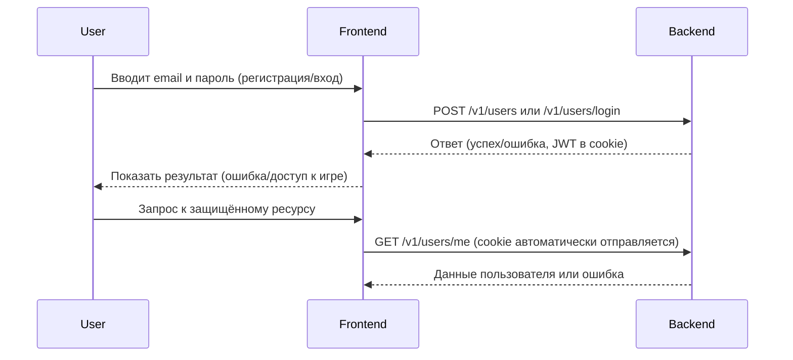

# Регистрация, авторизация и аутентификация пользователя/игрока

## 1. Описание функциональности

**User Story:**
Как новый пользователь, я хочу зарегистрироваться в системе, чтобы получить доступ к игровым возможностям.
Как зарегистрированный пользователь, я хочу войти в систему, чтобы продолжить игру и управлять своими игровыми сессиями.
Как игрок, я хочу быть уверенным, что мои данные защищены, а доступ к игровым функциям возможен только после успешной аутентификации.

**Acceptance Criteria:**

1. Пользователь может зарегистрироваться, указав email и пароль.
2. Система проверяет уникальность email.
3. Пароль хранится в базе данных только в хешированном виде.
4. После успешной регистрации пользователь может войти в систему, указав email и пароль.
5. При успешной авторизации выдаются JWT-токены (accessToken, refreshToken), которые автоматически устанавливаются в cookie (httpOnly).
6. Для доступа к защищённым эндпоинтам требуется валидный JWT-токен в cookie (accessToken).
7. В случае неуспешной авторизации возвращается корректная ошибка.
8. Пользователь может быть связан с сущностью игрока (Player) в рамках игровой сессии.

---

## 2. Описание API

### 2.1. Регистрация пользователя

#### POST /v1/users

**Назначение:** Регистрация нового пользователя.

**Request Body (`application/json`):**

| Поле       | Тип    | Описание                  | Обязательное |
|------------|--------|---------------------------|--------------|
| `email`    | String | Email пользователя        | Да           |
| `password` | String | Пароль пользователя       | Да           |

**Пример Request Body:**

```json
{
  "email": "user@example.com",
  "password": "password123"
}
```

**Responses:**

* **`201 Created` — Успешная регистрация**

    ```json
    {
      "id": "uuid-v4",
      "email": "user@example.com",
      "createdAt": "2024-06-01T12:00:00Z",
      "updatedAt": "2024-06-01T12:00:00Z"
    }
    ```

* **`400 Bad Request` — Некорректные данные**

    ```json
    {
      "error": "Validation Error",
      "messages": ["Email is required", "Password is required"]
    }
    ```

* **`409 Conflict` — Email уже зарегистрирован**

    ```json
    {
      "error": "Email already exists"
    }
    ```

---

### 2.2. Авторизация пользователя

#### POST /v1/users/login

**Назначение:** Аутентификация пользователя и выдача JWT токенов.

**Request Body (`application/json`):**

| Поле       | Тип    | Описание                  | Обязательное |
|------------|--------|---------------------------|--------------|
| `email`    | String | Email пользователя        | Да           |
| `password` | String | Пароль пользователя       | Да           |

**Пример Request Body:**

```json
{
  "email": "user@example.com",
  "password": "password123"
}
```

**Responses:**

* **`201 Created` — Успешная аутентификация**
  * JWT-токены (`accessToken`, `refreshToken`) устанавливаются в cookie (httpOnly, sameSite=lax, secure в production).
  * **Тело ответа:** Пустое (токены только в cookies).
* **`401 Unauthorized` — Неверные учетные данные**

    ```json
    {
      "error": "Invalid credentials"
    }
    ```

---

### 2.3. Получение информации о текущем пользователе

#### GET /v1/users/me

**Назначение:** Получение информации о текущем аутентифицированном пользователе.

**Cookie:**

* `accessToken` — должен быть установлен в браузере (httpOnly cookie).

**Responses:**

* **`200 OK`**

    ```json
    {
      "id": "uuid-v4",
      "email": "user@example.com",
      "createdAt": "2024-06-01T12:00:00Z",
      "updatedAt": "2024-06-01T12:00:00Z"
    }
    ```

* **`401 Unauthorized` — Неавторизованный запрос**

    ```json
    {
      "error": "Unauthorized"
    }
    ```

---

## 3. Связь пользователя и игрока

* **Пользователь** — это учетная запись, используемая для входа в систему.
* **Игрок (Player)** — сущность, связанная с пользователем в рамках конкретной игровой сессии (`gameSessionId`), содержит игровое состояние, ресурсы и т.д.
* Один пользователь может быть игроком в нескольких игровых сессиях.

---

## 4. Диаграмма последовательности (Mermaid)



---

## 5. Важно

> **Важно:** Пароли пользователей всегда должны храниться только в хешированном виде.
> Для доступа к защищённым ресурсам всегда требуется валидный JWT-токен в cookie (accessToken).

# Аналитика Аутентификации

Этот документ описывает систему аутентификации и авторизации в приложении.

---

## 1. Обзор Системы Аутентификации

### 1.1. Технологии

* **JWT (JSON Web Tokens)** для аутентификации
* **HttpOnly Cookies** для безопасного хранения токенов
* **Passport.js** для интеграции с NestJS
* **bcrypt** для хеширования паролей

### 1.2. Типы Токенов

* **Access Token** - короткоживущий токен для доступа к API
* **Refresh Token** - долгоживущий токен для обновления access token

---

## 2. Кастомный Декоратор `@UserId()`

### 2.1. Описание

Декоратор `@UserId()` автоматически извлекает ID пользователя из JWT токена, хранящегося в куки. Это упрощает код контроллеров и делает его более читаемым.

### 2.2. Использование

```typescript
import { UserId } from '@libs/nest-jwt';

@UseGuards(JwtAuthGuard)
@Post(':id/players')
public async joinGameSession(
  @Param('id') sessionId: string,
  @UserId() userId: string,
): Promise<void> {
  // userId автоматически извлечен из токена
  await this.gameSessionService.requestToJoinSession(userId, sessionId);
}
```

### 2.3. Преимущества

* **Упрощение кода**: Не нужно вручную извлекать `userId` из `req.user.sub`
* **Типобезопасность**: Декоратор возвращает строго типизированный `string`
* **Переиспользование**: Можно использовать в любом контроллере
* **Безопасность**: Автоматически проверяет наличие пользователя в запросе

### 2.4. Требования

* Декоратор должен использоваться только в методах, защищенных `@UseGuards(JwtAuthGuard)`
* JWT токен должен быть валидным и содержать поле `sub` с ID пользователя

---

## 3. Процесс Аутентификации

### 3.1. Регистрация

1. Пользователь отправляет POST запрос на `/v1/users` с email и паролем
2. Система проверяет уникальность email
3. Пароль хешируется с помощью bcrypt
4. Создается новый пользователь в базе данных
5. Возвращается объект `UserDto`

### 3.2. Вход в систему

1. Пользователь отправляет POST запрос на `/v1/users/login` с email и паролем
2. Система находит пользователя по email
3. Проверяется соответствие пароля хешу в базе данных
4. Генерируются access и refresh токены
5. Токены устанавливаются в httpOnly cookies
6. Возвращается пустой ответ (токены только в cookies)

### 3.3. Получение профиля

1. Пользователь отправляет GET запрос на `/v1/users/me`
2. `JwtAuthGuard` проверяет валидность access токена из cookies
3. `@UserId()` декоратор извлекает ID пользователя из токена
4. Система возвращает профиль пользователя

---

## 4. Безопасность

### 4.1. Хранение токенов

* Токены хранятся в **httpOnly cookies** (недоступны для JavaScript)
* **sameSite: 'lax'** для защиты от CSRF атак
* **secure: true** в production для передачи только по HTTPS

### 4.2. Валидация

* Все входные данные валидируются с помощью `class-validator`
* Пароли должны содержать минимум 6 символов
* Email должен быть валидным форматом

### 4.3. Обработка ошибок

* `401 Unauthorized` для неверных учетных данных
* `409 Conflict` для попытки регистрации с существующим email
* `400 Bad Request` для невалидных данных

---

## 5. Конфигурация

### 5.1. Переменные окружения

```env
JWT_SECRET=your-secret-key-here
ACCESS_TOKEN_EXPIRES_IN=15m
REFRESH_TOKEN_EXPIRES_IN=7d
NODE_ENV=development|production
```

### 5.2. Настройки токенов

* **Access Token**: короткий срок жизни (обычно 15-60 минут)
* **Refresh Token**: длинный срок жизни (обычно 7-30 дней)
* **Secret Key**: должен быть достаточно длинным и случайным

---

## 6. Примеры использования

### 6.1. Защищенный эндпоинт с получением userId

```typescript
@UseGuards(JwtAuthGuard)
@Get('profile')
public async getProfile(@UserId() userId: string): Promise<UserDto> {
  return this.userService.findById(userId);
}
```

### 6.2. Создание ресурса от имени пользователя

```typescript
@UseGuards(JwtAuthGuard)
@Post('sessions')
public async createSession(
  @Body() dto: CreateSessionDto,
  @UserId() userId: string,
): Promise<SessionDto> {
  return this.sessionService.create(dto, userId);
}
```

### 6.3. Обновление ресурса пользователя

```typescript
@UseGuards(JwtAuthGuard)
@Put('profile')
public async updateProfile(
  @Body() dto: UpdateProfileDto,
  @UserId() userId: string,
): Promise<UserDto> {
  return this.userService.updateProfile(userId, dto);
}
```
