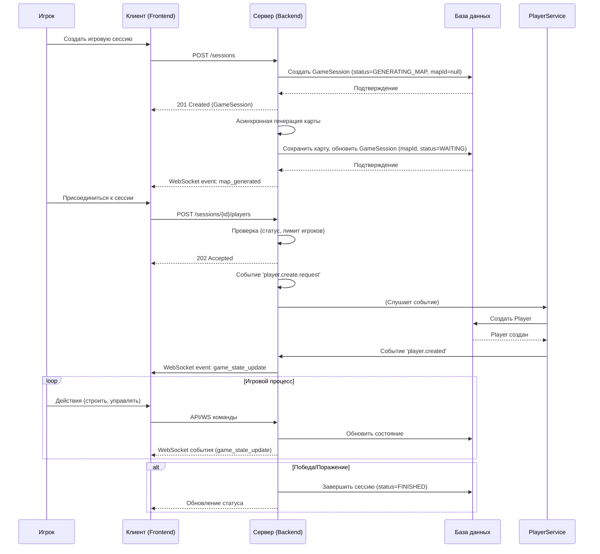
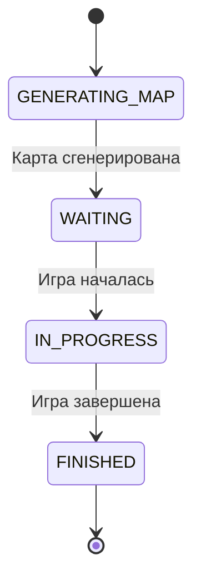

# Аналитика Игровой Сессии

## 1. Описание функциональности

**User Story:**
Как игрок, я хочу участвовать в игровой сессии, чтобы соревноваться с другими пользователями, исследовать карту, строить здания и управлять ресурсами, достигая победы в партии.

**Acceptance Criteria:**

1. Игровая сессия создаётся по запросу пользователя, процесс создания асинхронный.
2. Карта для сессии генерируется в фоне, после чего у сессии проставляется `mapId`.
3. В сессии участвуют один или несколько игроков, каждый из которых представлен сущностью `Player`.
4. Состояние сессии включает: карту, список игроков, их ресурсы, здания, юнитов и статус партии.
5. Игроки могут строить здания, производить юнитов, управлять траекториями и собирать ресурсы.
6. Сессия завершается при выполнении условий победы (например, уничтожение базы противника или выполнение сценарных целей).
7. Все изменения состояния сессии синхронизируются между клиентами в реальном времени через WebSocket.

---

## 2. Модель данных: `GameSession`

| Поле           | Тип данных    | Описание                                 | Ограничения/Примечания         | Обязательное |
|----------------|---------------|------------------------------------------|--------------------------------|--------------|
| `id`           | UUID          | Уникальный идентификатор сессии          | Генерируется системой (PK)     | Да           |
| `map_id`       | UUID / null   | Идентификатор сгенерированной карты      | Может быть null до завершения генерации | Нет          |
| `status`       | Enum          | Текущий статус игры                      | `WAITING`, `GENERATING_MAP`, `IN_PROGRESS`, `FINISHED` | Да    |
| `created_at`   | DateTime      | Дата и время создания                    |                                | Да           |
| `finished_at`  | DateTime      | Дата и время завершения                  |                                | Нет          |

**Связанные сущности:**

- `Player` — игроки, участвующие в сессии.
- `Building` — здания, построенные игроками.
- `Unit` — юниты, принадлежащие игрокам.
- `Map` — карта, сгенерированная для сессии.

**Пример объекта:**

```json
{
  "id": "a1b2c3d4-e5f6-7890-1234-567890abcdef",
  "mapId": null,
  "status": "GENERATING_MAP",
  "createdAt": "2024-06-01T12:00:00Z",
  "finishedAt": null
}
```

---

## 3. Жизненный цикл игровой сессии

1. **Создание:**
   Пользователь инициирует создание сессии через API (`POST /sessions`). Сессия создаётся со статусом `GENERATING_MAP`, поле `mapId` отсутствует (null).
2. **Генерация карты:**
   Сервер асинхронно генерирует карту. После завершения генерации карта сохраняется, у сессии обновляется поле `mapId`, статус меняется на `WAITING`.
3. **Присоединение игроков:**
   Другие пользователи могут присоединиться к сессии после генерации карты.
4. **Старт:**
   После набора необходимого количества игроков сессия переходит в статус `IN_PROGRESS`.
5. **Игровой процесс:**
   Игроки строят здания, производят юнитов, исследуют карту, взаимодействуют друг с другом.
6. **Завершение:**
   Сессия завершается при выполнении условий победы или по истечении времени. Статус меняется на `FINISHED`, фиксируется время завершения.

---

## 4. API для работы с игровой сессией

### Создание сессии

**POST /sessions**

- Тело запроса не содержит параметров выбора карты, карта генерируется автоматически в фоне.

**Ответ:**

- `201 Created` — объект `GameSession` со статусом `GENERATING_MAP`, поле `mapId` = null.

### Получение состояния сессии

**GET /sessions/{sessionId}**

- Возвращает текущее состояние сессии: если карта ещё не сгенерирована, `mapId` = null, статус = `GENERATING_MAP`.
- После генерации карты возвращается актуальный объект с заполненным `mapId` и статусом `WAITING` или `IN_PROGRESS`.

---

## 5. События WebSocket

- `game_state_update` — обновление состояния сессии.
- `map_generated` — карта успешно сгенерирована, сессия обновлена (отправляется всем участникам).
- `unit_spawned` — появление нового юнита.
- `building_created` — построено новое здание.
- `resource_updated` — изменение ресурсов игрока.

---

## 6. Диаграмма последовательности



---

## 7. Важно

> **Важно:** Процесс генерации карты и переход сессии в рабочий статус должны быть надёжно синхронизированы и информировать всех участников о готовности карты через события WebSocket.

### 2.1. Статусы игровых сессий

| Статус | Описание | Возможные переходы |
|--------|----------|-------------------|
| `GENERATING_MAP` | Карта генерируется асинхронно | → `WAITING` |
| `WAITING` | Ожидание присоединения игроков | → `IN_PROGRESS` |
| `IN_PROGRESS` | Игра в процессе | → `FINISHED` |
| `FINISHED` | Игра завершена | - |

### 2.2. Жизненный цикл игровой сессии


