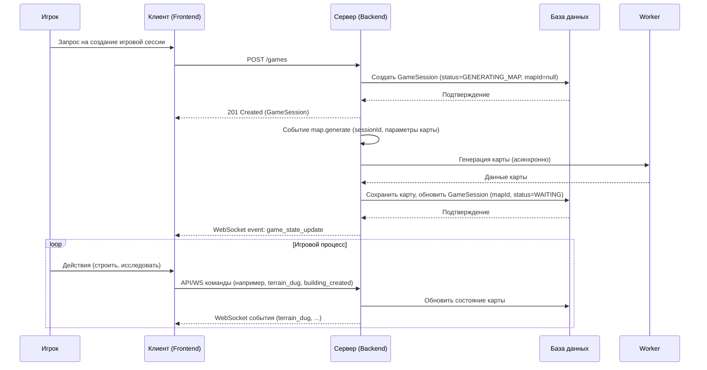

# Аналитика Карты (Map)

## 1. Описание функциональности

**User Story:**
Как игрок, я хочу, чтобы карта генерировалась автоматически для каждой игровой сессии, чтобы исследовать территорию, строить здания и управлять юнитами в уникальных условиях.

**Acceptance Criteria:**

1. Карта создаётся автоматически при запуске игровой сессии (по событию).
2. Карта представляет собой 2D-сетку с различными типами пород и ресурсов.
3. Для каждой карты определяются стартовые точки для игроков.
4. Игроки видят только исследованные области карты (реализован "туман войны").
5. Карта хранит информацию о ландшафте, размерах и стартовых позициях.
6. Все изменения карты (раскопки, постройки) синхронизируются между клиентами в реальном времени через WebSocket.

---

## 2. Модель данных: `Map`

| Поле           | Тип данных | Описание                                   | Ограничения/Примечания                | Обязательное |
|----------------|------------|--------------------------------------------|---------------------------------------|--------------|
| `id`           | UUID       | Уникальный идентификатор карты             | Генерируется системой (PK)            | Да           |
| `size`         | JSON       | Размеры карты (ширина и высота)            | Пример: `{ "width": 100, "height": 100 }`| Да           |
| `terrainData`  | JSON       | Данные о ландшафте (типы пород, ресурсы)   | Структура зависит от генератора карты | Да           |
| `spawnPoints`  | JSON       | Координаты стартовых позиций игроков       | Массив объектов координат             | Да           |

**Пример объекта:**

```json
{
  "id": "a1b2c3d4-e5f6-7890-1234-567890abcdef",
  "size": { "width": 100, "height": 100 },
  "terrainData": [
    [ "Dirt", "Rock", "Bedrock", ... ],
    ...
  ],
  "spawnPoints": [
    { "x": 10, "y": 10 },
    { "x": 90, "y": 90 }
  ]
}
```

---

## 3. Жизненный цикл карты

1. **Генерация:**
   Карта создаётся автоматически при запуске игровой сессии или по отдельному событию. В процессе генерации определяются размеры, структура ландшафта и стартовые позиции.
2. **Использование:**
   Игроки исследуют карту, строят здания, перемещают юнитов. Все действия отражаются на состоянии карты (например, изменяется тип породы в ячейке после раскопки).
3. **Синхронизация:**
   Все изменения карты (раскопки, постройки) транслируются всем участникам сессии через WebSocket-события.
4. **Завершение:**
   После окончания игровой сессии карта может быть архивирована или удалена.

---

## 4. API и событийная архитектура

> **Примечание:** Прямой REST API для создания карты отсутствует. Карта создаётся только по событию `map.generate`, инициируемому при создании игровой сессии. Получить карту можно только по её идентификатору (`GET /map/:id`).

---

## 5. События

- `map.generate` — инициирует генерацию карты (вызывается сервисом игровой сессии).
- `map.generated` — карта успешно сгенерирована, содержит идентификаторы сессии и карты.
- `game_state_update` — обновление состояния игровой сессии (отправляется всем участникам через WebSocket).
- `terrain_dug` — участок карты был раскопан (изменился тип породы).
- `building_created` — построено новое здание (может влиять на карту).

---

## 6. Диаграмма последовательности



---

## 7. Важно

> **Важно:** Карта должна генерироваться до начала игровой сессии и быть синхронизирована между всеми участниками. Все изменения карты должны транслироваться в реальном времени для корректного отображения состояния у всех игроков.
