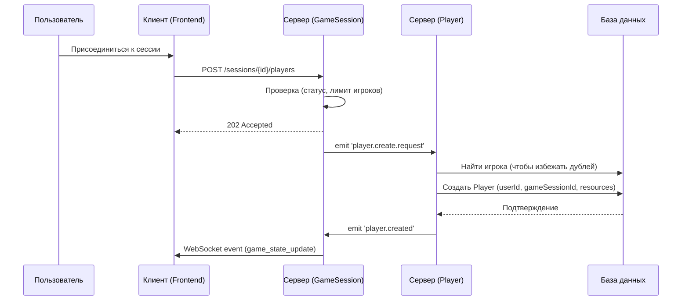

# Аналитика Игрока (Player)

## 1. Описание функциональности

**User Story:**
Как участник игровой сессии, я хочу управлять своим игровым состоянием (ресурсами, зданиями, юнитами), чтобы взаимодействовать с другими игроками, достигать целей партии и стремиться к победе.

**Acceptance Criteria:**

1. Игрок создаётся при присоединении пользователя к игровой сессии.
2. Игрок связан с конкретным пользователем (`userId`) и сессией (`gameSessionId`).
3. Игрок обладает собственным набором ресурсов, которые могут изменяться в ходе партии.
4. Игрок может строить здания, производить юнитов и управлять ими.
5. Игрок может быть объявлен победителем по итогам партии (флаг `isWinner`).
6. Все изменения состояния игрока (ресурсы, победа) синхронизируются между клиентами в реальном времени через WebSocket.
7. Игрок может быть удалён из сессии при выходе пользователя или завершении партии.

---

## 2. Модель данных: `Player`

| Поле               | Тип данных | Описание                        | Ограничения/Примечания         | Обязательное |
|--------------------|------------|---------------------------------|--------------------------------|--------------|
| `id`               | UUID       | Уникальный идентификатор игрока | Генерируется системой (PK)     | Да           |
| `user_id`          | UUID       | Идентификатор пользователя      | Ссылка на `User.id`            | Да           |
| `game_session_id`  | UUID       | Идентификатор игровой сессии    | Ссылка на `GameSession.id`     | Да           |
| `resources`        | JSON       | Объект с количеством ресурсов   | `{"gold": 100, "crystals": 0}` | Да           |
| `is_winner`        | Boolean    | Флаг, был ли игрок победителем  |                                | Нет          |

**Связанные сущности:**

- `User` — пользователь, которому принадлежит игрок.
- `GameSession` — сессия, в которой участвует игрок.
- `Building` — здания, построенные игроком.
- `Unit` — юниты, принадлежащие игроку.

**Пример объекта:**


```json
{
  "id": "b2c3d4e5-f6a1-7890-1234-567890abcdef",
  "userId": "u1b2c3d4-e5f6-7890-1234-567890abcdef",
  "gameSessionId": "a1b2c3d4-e5f6-7890-1234-567890abcdef",
  "resources": { "gold": 150, "crystals": 20 },
  "isWinner": false
}
```

---

## 3. Жизненный цикл игрока

1. **Создание:**
   Игрок создаётся при присоединении пользователя к сессии (например, через `POST /sessions/{id}/players`). В этот момент инициализируются стартовые ресурсы.
2. **Игровой процесс:**
   Игрок управляет своими ресурсами, строит здания, производит юнитов, взаимодействует с другими игроками.
3. **Обновление состояния:**
   Все изменения ресурсов, построек и юнитов игрока фиксируются и синхронизируются между клиентами через WebSocket-события.
4. **Победа/Поражение:**
   По завершении партии игроку может быть присвоен флаг `isWinner = true` (например, при выполнении условий победы).
5. **Удаление/Завершение:**
   После завершения сессии или выхода пользователя игрок может быть удалён из сессии.

---

## 4. API для работы с игроком

> **Примечание:** Прямое управление игроками (создание, удаление) происходит через эндпоинты и события игровой сессии (`/sessions/{id}/players`). Это отражает тот факт, что игрок не существует вне контекста игровой сессии.

- **Запрос на присоединение к сессии:**
  `POST /sessions/{id}/players` — инициирует асинхронный процесс создания нового игрока для пользователя в указанной сессии.

- **Получение состояния игрока:**
  Обычно возвращается в составе состояния сессии (`GET /sessions/{sessionId}`) или через WebSocket-события.

**WebSocket-события:**
- `resource_updated` — изменение ресурсов игрока.
- `building_created` — построено новое здание игрока.
- `unit_spawned` — создан новый юнит игрока.
  - `game_state_update` — общее обновление состояния игрока и сессии.

---

## 5. События WebSocket

- `resource_updated` — изменение ресурсов игрока.
- `building_created` — построено новое здание игрока.
- `unit_spawned` — создан новый юнит игрока.
- `game_state_update` — обновление состояния игрока и сессии.

---

## 6. Диаграмма последовательности



---

## 7. Важно


> **Важно:** Все изменения состояния игрока должны быть синхронизированы между клиентами в реальном времени через WebSocket. Присвоение статуса победителя (`isWinner`) должно происходить атомарно и быть зафиксировано в базе данных.
