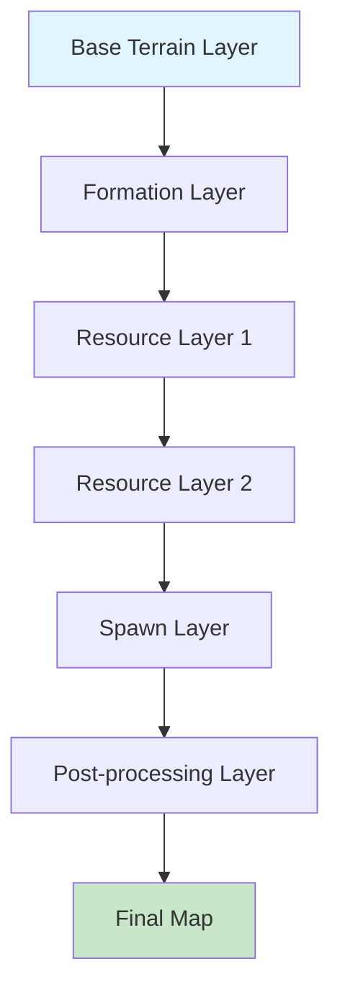

# Система слоевой генерации карт

> **💡 Концепция:** Конфигурируемый генератор карт, работающий по принципу композиции слоев. Каждый слой представляет отдельный алгоритм, применяемый поверх предыдущих результатов.

## 🎯 Концепция и преимущества

### Принцип работы



### Ключевые преимущества

1. **Композиция:** Любые комбинации слоев для создания уникальных карт
2. **Конфигурируемость:** JSON/YAML конфигурация без изменения кода
3. **A/B тестирование:** Легкое переключение между алгоритмами
4. **Переиспользование:** Один слой в разных типах карт
5. **Отладка:** Возможность включать/выключать отдельные слои
6. **Производительность:** Ленивое выполнение и кэширование слоев

---

## 🏗️ Архитектура системы

### Базовые интерфейсы

```typescript
// TODO: libs/map-generation/src/layers/LayerEngine.ts
export interface MapLayer {
  readonly name: string;
  readonly version: string;
  readonly dependencies: string[]; // Зависимости от других слоев

  apply(context: LayerContext): Promise<LayerResult>;
  validate(config: LayerConfig): ValidationResult;
  getMetadata(): LayerMetadata;
}

export interface LayerContext {
  terrainData: TerrainType[][];
  size: { x: number; y: number };
  config: LayerConfig;
  previousResults: Map<string, LayerResult>;
  globalConfig: GlobalGenerationConfig;
  randomSeed?: number;
}

export interface LayerResult {
  success: boolean;
  modificationsCount: number;
  executionTime: number;
  metadata: Record<string, any>;
  artifacts?: LayerArtifact[]; // Дополнительные данные (позиции ресурсов, etc.)
}

export interface LayerConfig {
  enabled: boolean;
  priority: number;
  parameters: Record<string, any>;
  conditions?: LayerCondition[];
}
```

### Система управления слоями

```typescript
// TODO: libs/map-generation/src/layers/LayerEngine.ts
export class LayerEngine {
  private layers = new Map<string, MapLayer>();
  private executionPlan: LayerExecutionPlan;

  constructor(private config: LayeredGenerationConfig) {
    this.buildExecutionPlan();
  }

  registerLayer(layer: MapLayer): void {
    this.validateLayerCompatibility(layer);
    this.layers.set(layer.name, layer);
    this.rebuildExecutionPlan();
  }

  async generateMap(
    size: { x: number; y: number },
    globalConfig: GlobalGenerationConfig
  ): Promise<GenerationResult> {
    const context = this.createInitialContext(size, globalConfig);
    const results = new Map<string, LayerResult>();

    for (const step of this.executionPlan.steps) {
      const layer = this.layers.get(step.layerName);
      const layerContext = {
        ...context,
        config: step.config,
        previousResults: results
      };

      try {
        const result = await this.executeLayerWithTimeout(layer, layerContext);
        results.set(step.layerName, result);

        this.logLayerExecution(step.layerName, result);
      } catch (error) {
        return this.handleLayerError(step.layerName, error, results);
      }
    }

    return this.buildFinalResult(context, results);
  }

  private buildExecutionPlan(): void {
    // Топологическая сортировка слоев по зависимостям
    const sortedLayers = this.topologicalSort();
    this.executionPlan = {
      steps: sortedLayers.map(layer => ({
        layerName: layer.name,
        config: this.config.layers[layer.name] || this.getDefaultConfig(layer)
      }))
    };
  }
}
```

---

## 📋 Типы слоев

### 1. **Base Layers** - Базовые слои террейна

```typescript
// TODO: libs/map-generation/src/layers/base/BaseTerrainLayer.ts
export class BaseTerrainLayer implements MapLayer {
  readonly name = 'base-terrain';
  readonly version = '1.0.0';
  readonly dependencies = [];

  async apply(context: LayerContext): Promise<LayerResult> {
    const { terrainData, size, config } = context;
    let modificationsCount = 0;

    // Инициализация базового террейна
    for (let y = 0; y < size.y; y++) {
      for (let x = 0; x < size.x; x++) {
        terrainData[y][x] = this.calculateBaseTerrain(x, y, context);
        modificationsCount++;
      }
    }

    return {
      success: true,
      modificationsCount,
      executionTime: performance.now(),
      metadata: {
        algorithm: config.parameters.algorithm || 'default',
        coverage: '100%'
      }
    };
  }

  private calculateBaseTerrain(x: number, y: number, context: LayerContext): TerrainType {
    const algorithm = context.config.parameters.algorithm;

    switch (algorithm) {
      case 'perlin-noise':
        return this.perlinNoiseAlgorithm(x, y, context);
      case 'cellular-automata':
        return this.cellularAutomataAlgorithm(x, y, context);
      case 'distance-based':
        return this.distanceBasedAlgorithm(x, y, context);
      default:
        return TerrainType.Dirt;
    }
  }
}
```

### 2. **Formation Layers** - Геологические формации

```typescript
// TODO: libs/map-generation/src/layers/formations/BedrockFormationLayer.ts
export class BedrockFormationLayer implements MapLayer {
  readonly name = 'bedrock-formations';
  readonly version = '1.0.0';
  readonly dependencies = ['base-terrain'];

  async apply(context: LayerContext): Promise<LayerResult> {
    const { terrainData, size, config } = context;
    const formationCount = this.calculateFormationCount(size, config);
    let modificationsCount = 0;

    for (let i = 0; i < formationCount; i++) {
      const formation = this.generateFormation(size, config);
      modificationsCount += this.applyFormation(terrainData, formation);
    }

    return {
      success: true,
      modificationsCount,
      executionTime: performance.now(),
      metadata: {
        formationsCreated: formationCount,
        algorithm: config.parameters.type || 'radial'
      },
      artifacts: [
        {
          type: 'formations',
          data: { count: formationCount }
        }
      ]
    };
  }
}

export class RockVeinLayer implements MapLayer {
  readonly name = 'rock-veins';
  readonly version = '1.0.0';
  readonly dependencies = ['base-terrain'];

  async apply(context: LayerContext): Promise<LayerResult> {
    // Генерация каменных жил
    const veins = this.generateVeins(context);
    return this.applyVeinsToTerrain(context.terrainData, veins);
  }
}
```

### 3. **Resource Layers** - Слои ресурсов

```typescript
// TODO: libs/map-generation/src/layers/resources/GoldResourceLayer.ts
export class GoldResourceLayer implements MapLayer {
  readonly name = 'gold-resources';
  readonly version = '1.0.0';
  readonly dependencies = ['base-terrain', 'spawn-points'];

  async apply(context: LayerContext): Promise<LayerResult> {
    const spawnPoints = this.getSpawnPointsFromPreviousLayer(context);
    const zones = this.calculateResourceZones(context.size, context.config);

    const placements = await this.findValidPlacements(
      context.terrainData,
      spawnPoints,
      zones,
      context.config.parameters
    );

    let modificationsCount = 0;
    for (const placement of placements) {
      modificationsCount += this.createResourceCluster(
        context.terrainData,
        placement,
        context.config.parameters.clustering
      );
    }

    return {
      success: true,
      modificationsCount,
      executionTime: performance.now(),
      metadata: {
        clustersCreated: placements.length,
        totalResources: modificationsCount,
        strategy: context.config.parameters.strategy || 'zoned'
      },
      artifacts: [
        {
          type: 'resource-clusters',
          data: {
            type: 'gold',
            positions: placements
          }
        }
      ]
    };
  }
}

export class IronResourceLayer implements MapLayer {
  readonly name = 'iron-resources';
  readonly version = '1.0.0';
  readonly dependencies = ['base-terrain', 'spawn-points'];
  // Аналогичная реализация для железа
}

export class CrystalResourceLayer implements MapLayer {
  readonly name = 'crystal-resources';
  readonly version = '1.0.0';
  readonly dependencies = ['base-terrain', 'spawn-points'];
  // Аналогичная реализация для кристаллов
}
```

### 4. **Spawn Layers** - Слои спавн-поинтов

```typescript
// TODO: libs/map-generation/src/layers/spawn/SpawnPointLayer.ts
export class SpawnPointLayer implements MapLayer {
  readonly name = 'spawn-points';
  readonly version = '1.0.0';
  readonly dependencies = ['base-terrain'];

  async apply(context: LayerContext): Promise<LayerResult> {
    const playersCount = context.globalConfig.playersCount;
    const algorithm = context.config.parameters.algorithm || 'balanced';

    const positions = this.calculateSpawnPositions(
      context.size,
      playersCount,
      algorithm,
      context.config.parameters
    );

    // Модификация террейна вокруг спавн-поинтов
    let modificationsCount = 0;
    for (const position of positions) {
      modificationsCount += this.clearSpawnArea(
        context.terrainData,
        position,
        context.config.parameters.clearRadius || 4
      );
    }

    return {
      success: true,
      modificationsCount,
      executionTime: performance.now(),
      metadata: {
        spawnPointsCreated: positions.length,
        algorithm,
        playersCount
      },
      artifacts: [
        {
          type: 'spawn-points',
          data: { positions }
        }
      ]
    };
  }
}
```

### 5. **Post-processing Layers** - Постобработка

```typescript
// TODO: libs/map-generation/src/layers/postprocessing/AccessibilityLayer.ts
export class AccessibilityLayer implements MapLayer {
  readonly name = 'accessibility';
  readonly version = '1.0.0';
  readonly dependencies = ['spawn-points'];

  async apply(context: LayerContext): Promise<LayerResult> {
    const spawnPoints = this.getSpawnPointsFromPreviousLayer(context);
    let modificationsCount = 0;

    // Обеспечение доступности спавн-поинтов
    for (const spawn of spawnPoints) {
      modificationsCount += this.ensureSpawnAccessibility(
        context.terrainData,
        spawn,
        context.config.parameters
      );
    }

    return {
      success: true,
      modificationsCount,
      executionTime: performance.now(),
      metadata: {
        accessibilityFixed: modificationsCount > 0,
        spawnPointsProcessed: spawnPoints.length
      }
    };
  }
}

export class BalanceValidationLayer implements MapLayer {
  readonly name = 'balance-validation';
  readonly version = '1.0.0';
  readonly dependencies = ['*']; // Зависит от всех предыдущих слоев

  async apply(context: LayerContext): Promise<LayerResult> {
    const validationResults = await this.validateMapBalance(context);

    if (!validationResults.isValid) {
      throw new LayerExecutionError(
        'Map balance validation failed',
        validationResults.issues
      );
    }

    return {
      success: true,
      modificationsCount: 0,
      executionTime: performance.now(),
      metadata: {
        validationPassed: true,
        score: validationResults.score,
        checks: validationResults.checks
      }
    };
  }
}
```

---

## ⚙️ Конфигурация слоев

### Пример конфигурации карты

```yaml
# TODO: Создать примеры конфигураций в configs/map-types/
# configs/map-types/balanced-pvp.yaml
name: "Balanced PvP Map"
version: "1.0.0"
description: "Сбалансированная карта для PvP сражений"

global:
  size: { x: 500, y: 500 }
  playersCount: 4
  seed: null # auto-generate

layers:
  base-terrain:
    enabled: true
    priority: 0
    parameters:
      algorithm: "distance-based"
      rockMultiplier: 0.4
      bedrockBonus: 0.15

  bedrock-formations:
    enabled: true
    priority: 10
    parameters:
      type: "radial"
      density: 800
      radiusRange: { min: 2, max: 6 }
      probability: 0.8

  rock-veins:
    enabled: true
    priority: 15
    parameters:
      density: 400
      lengthRange: { min: 5, max: 15 }
      thickness: { min: 1, max: 3 }

  spawn-points:
    enabled: true
    priority: 20
    parameters:
      algorithm: "corner-balanced"
      margin: 15
      clearRadius: 4
      immediateRadius: 2

  gold-resources:
    enabled: true
    priority: 30
    parameters:
      strategy: "zoned"
      baseDensity: 0.025
      playerMultiplier: 1.3
      clustering:
        radiusRange: { min: 2, max: 7 }
        density: 0.85
      zones:
        central: { percentage: 40, bonus: 1.2 }
        middle: { percentage: 60, bonus: 1.0 }

  iron-resources:
    enabled: true
    priority: 35
    parameters:
      strategy: "outer-zones"
      ratio: 0.8 # 80% от количества золота
      clustering:
        radiusRange: { min: 3, max: 7 }
        density: 0.7

  crystal-resources:
    enabled: true
    priority: 40
    parameters:
      strategy: "central-only"
      ratio: 0.3 # 30% от количества золота
      clustering:
        radiusRange: { min: 3, max: 6 }
        density: 0.95

  accessibility:
    enabled: true
    priority: 90
    parameters:
      guaranteedResources: true
      resourceDistance: { min: 5, max: 8 }

  balance-validation:
    enabled: true
    priority: 100
    parameters:
      strictMode: true
      minResourcesPerPlayer: 50
      maxDistanceVariance: 0.2
```

### Конфигурация для PvE карты

```yaml
# configs/map-types/exploration-pve.yaml
name: "Exploration PvE Map"
version: "1.0.0"

global:
  size: { x: 800, y: 800 }
  playersCount: 2

layers:
  base-terrain:
    enabled: true
    priority: 0
    parameters:
      algorithm: "perlin-noise"
      scale: 0.05
      octaves: 4

  # Больше формаций для исследования
  bedrock-formations:
    enabled: true
    priority: 10
    parameters:
      density: 600 # Больше формаций
      radiusRange: { min: 3, max: 8 }

  cave-systems:
    enabled: true
    priority: 12
    parameters:
      algorithm: "cellular-automata"
      density: 0.1
      iterations: 5

  # Более разнообразные ресурсы
  rare-resources:
    enabled: true
    priority: 50
    parameters:
      types: ["platinum", "gems", "artifacts"]
      spawnChance: 0.001

  # Отключаем строгую валидацию баланса
  balance-validation:
    enabled: false
```

---

## 🎮 Система управления конфигурациями

### MapTypeManager

```typescript
// TODO: libs/map-generation/src/config/MapTypeManager.ts
export class MapTypeManager {
  private configs = new Map<string, LayeredGenerationConfig>();
  private presets = new Map<string, ConfigPreset>();

  constructor() {
    this.loadBuiltInConfigs();
  }

  async loadConfiguration(configPath: string): Promise<LayeredGenerationConfig> {
    const configData = await this.loadConfigFile(configPath);
    const config = this.parseAndValidateConfig(configData);
    this.configs.set(config.name, config);
    return config;
  }

  getAvailableMapTypes(): MapTypeInfo[] {
    return Array.from(this.configs.values()).map(config => ({
      name: config.name,
      description: config.description,
      recommendedPlayers: config.global.playersCount,
      estimatedSize: config.global.size,
      features: this.extractFeatures(config)
    }));
  }

  createCustomConfiguration(
    baseName: string,
    overrides: Partial<LayeredGenerationConfig>
  ): LayeredGenerationConfig {
    const baseConfig = this.configs.get(baseName);
    if (!baseConfig) {
      throw new Error(`Base configuration '${baseName}' not found`);
    }

    return this.mergeConfigurations(baseConfig, overrides);
  }

  // A/B Testing support
  async runConfigComparison(
    configA: string,
    configB: string,
    testParams: ComparisonParams
  ): Promise<ConfigComparisonResult> {
    const results = await Promise.all([
      this.generateTestMaps(configA, testParams.sampleSize),
      this.generateTestMaps(configB, testParams.sampleSize)
    ]);

    return this.analyzeGenerationResults(results[0], results[1]);
  }
}
```

### Динамическое создание конфигураций

```typescript
// TODO: apps/backend/src/map/api/map-configuration.controller.ts
@Controller('v1/map-configs')
export class MapConfigurationController {

  @Get('types')
  async getAvailableMapTypes(): Promise<MapTypeInfo[]> {
    return this.mapTypeManager.getAvailableMapTypes();
  }

  @Post('custom')
  async createCustomMapType(
    @Body() request: CreateCustomMapTypeRequest
  ): Promise<LayeredGenerationConfig> {
    return this.mapTypeManager.createCustomConfiguration(
      request.baseType,
      request.modifications
    );
  }

  @Post('preview')
  async previewMapGeneration(
    @Body() config: LayeredGenerationConfig
  ): Promise<MapPreviewResult> {
    // Генерация превью карты (например, 100x100) для быстрого просмотра
    const smallConfig = this.scaleConfigForPreview(config);
    const result = await this.layerEngine.generateMap(
      { x: 100, y: 100 },
      smallConfig.global
    );

    return {
      terrainPreview: this.generateAsciiVisualization(result.terrainData),
      statistics: result.statistics,
      layerResults: result.layerResults
    };
  }
}
```

---

## 🧪 Тестирование и валидация

### Автоматическое тестирование слоев

```typescript
// TODO: libs/map-generation/src/testing/LayerTestSuite.ts
export class LayerTestSuite {

  async testLayer(
    layer: MapLayer,
    testCases: LayerTestCase[]
  ): Promise<LayerTestResult[]> {
    const results: LayerTestResult[] = [];

    for (const testCase of testCases) {
      const context = this.createTestContext(testCase);

      try {
        const result = await layer.apply(context);
        const validation = await this.validateLayerResult(result, testCase.expectedOutcome);

        results.push({
          testCase: testCase.name,
          passed: validation.isValid,
          executionTime: result.executionTime,
          issues: validation.issues,
          metrics: this.calculateTestMetrics(context, result)
        });
      } catch (error) {
        results.push({
          testCase: testCase.name,
          passed: false,
          error: error.message,
          executionTime: -1
        });
      }
    }

    return results;
  }

  async runPerformanceBenchmark(
    layer: MapLayer,
    mapSizes: Array<{ x: number; y: number }>
  ): Promise<PerformanceBenchmarkResult> {
    const results: PerformanceData[] = [];

    for (const size of mapSizes) {
      const context = this.createBenchmarkContext(size);
      const startTime = performance.now();

      await layer.apply(context);

      const endTime = performance.now();
      results.push({
        size,
        executionTime: endTime - startTime,
        memoryUsage: this.measureMemoryUsage(),
        modificationsPerSecond: context.modificationsCount / (endTime - startTime) * 1000
      });
    }

    return {
      layer: layer.name,
      results,
      scalingFactor: this.calculateScalingFactor(results)
    };
  }
}
```

---

## 📊 Мониторинг и аналитика

### Система метрик для слоев

```typescript
// TODO: libs/map-generation/src/monitoring/LayerMetrics.ts
export class LayerMetricsCollector {

  collectLayerMetrics(layerName: string, result: LayerResult): void {
    const metrics = {
      'layer.execution_time': result.executionTime,
      'layer.modifications_count': result.modificationsCount,
      'layer.success_rate': result.success ? 1 : 0,
      'layer.memory_usage': this.getMemoryUsage(),
    };

    this.metricsService.recordMetrics(metrics, {
      layer: layerName,
      version: this.getLayerVersion(layerName)
    });
  }

  async generateLayerAnalytics(
    layerName: string,
    timeRange: TimeRange
  ): Promise<LayerAnalytics> {
    const metrics = await this.metricsService.queryMetrics(layerName, timeRange);

    return {
      averageExecutionTime: this.calculateAverage(metrics.execution_time),
      successRate: this.calculateSuccessRate(metrics.success_rate),
      performanceTrend: this.analyzeTrend(metrics.execution_time),
      errorPatterns: this.analyzeErrors(metrics.errors),
      recommendations: this.generateOptimizationRecommendations(metrics)
    };
  }
}
```

---

## ✅ Преимущества layered-системы

### По сравнению с монолитной генерацией

1. **🔧 Гибкость конфигурации:**
   - Легкое переключение алгоритмов без изменения кода
   - A/B тестирование различных комбинаций слоев
   - Создание новых типов карт через конфигурацию

2. **🧪 Тестируемость:**
   - Unit-тесты для каждого слоя отдельно
   - Изолированное тестирование алгоритмов
   - Автоматизированные performance тесты

3. **🚀 Производительность:**
   - Ленивое выполнение слоев
   - Возможность кэширования результатов
   - Параллельное выполнение независимых слоев

4. **🔍 Отладка:**
   - Пошаговая генерация с визуализацией
   - Детальные метрики для каждого слоя
   - Легкое выявление проблемных алгоритмов

5. **📈 Масштабируемость:**
   - Простое добавление новых слоев
   - Версионирование алгоритмов
   - Миграция между версиями слоев

---

## 🔗 Интеграция с существующими планами

Эта система **идеально дополняет** существующие планы рефакторинга:

### С [рефакторингом алгоритмов](./10_map_generation_refactoring_plan.md)

- Каждый утилитарный класс становится отдельным слоем
- Упрощается тестирование и переиспользование
- Четкое разделение ответственности

### С [планом оптимизации](./09_map_optimization_refactoring_plan.md)

- Слои легко адаптируются для работы с чанками
- Можно применять разные слои к разным областям карты
- Оптимизация производительности отдельных алгоритмов

### Рекомендуемый порядок реализации

1. **Рефакторинг алгоритмов** → утилитарные классы
2. **Layered-система** → обертка над утилитами
3. **Chunking оптимизация** → применение к layer-based архитектуре

---

> **🎯 Результат:** Получается мощная, гибкая и масштабируемая система генерации карт, которая позволяет создавать любые типы карт через конфигурацию, обеспечивает высокое качество кода и простоту поддержки.
